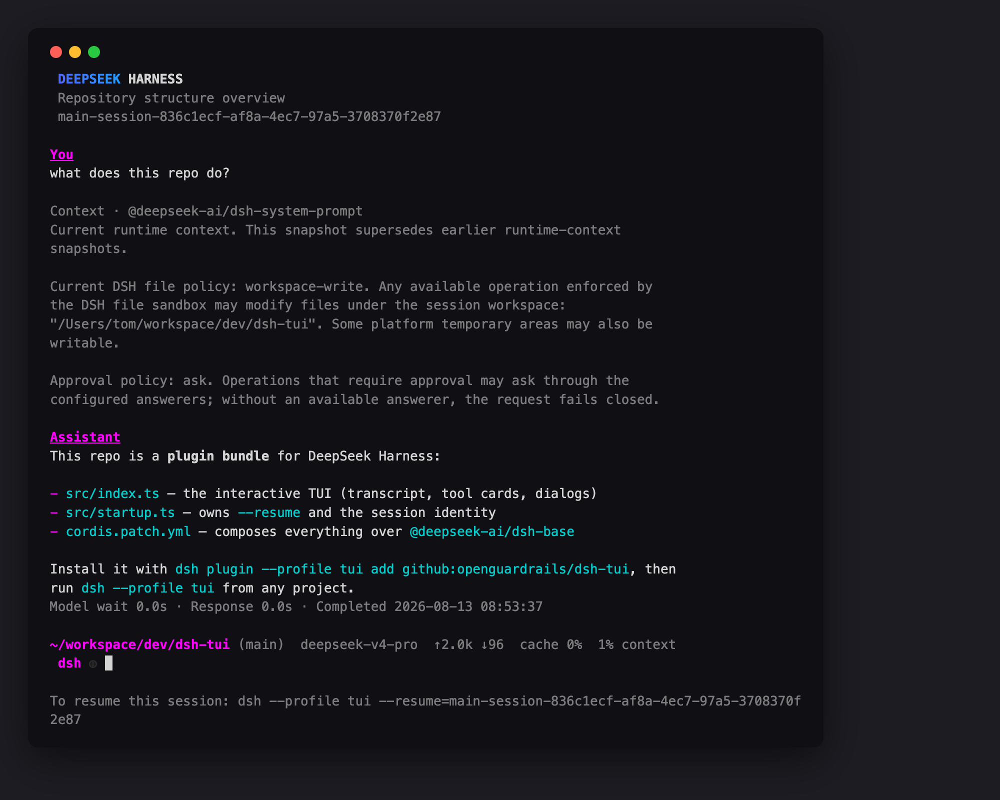

# @dshtui/dsh-tui

English | [中文](README.zh.md)

An interactive terminal (TUI) front door for [DeepSeek Harness](https://github.com/deepseek-ai/deepseek-harness) agents — a Claude Code / Codex-style chat interface in your terminal, installed as an out-of-tree dsh plugin bundle. Built on [`@earendil-works/pi-tui`](https://www.npmjs.com/package/@earendil-works/pi-tui).

It composes over the official `@deepseek-ai/dsh-base` bundle, so the whole plugin ecosystem — shell and filesystem tools, skills, subagents, workflows, sandbox approvals — is the same one the official web surface uses. Nothing is forked.



## Features

- Streaming model output and reasoning, rendered as Markdown
- Tool-call cards with terminal / diff / generic render intents; Ctrl+O cycles collapsed → expanded → hidden
- Approval and `ask_user_question` dialogs, plan-mode review included
- `@file` path autocomplete and `@session` reference cards
- Slash commands: `/model` (with reasoning-effort selection), `/resume`, `/compact`, `/details`, `/help`, and every command other plugins register
- Standing todo panel, token usage and context-pressure status line, session titles
- Configurable theme; truecolor detected from `COLORTERM`

## Install

Requires Node `^22.19 || >=24` and the `dsh` CLI (`npm i -g @deepseek-ai/dsh@next`).

```sh
dsh plugin --profile tui add @dshtui/dsh-tui
dsh --profile tui                                      # start a session in the current directory
dsh --profile tui --resume <session-id>                # resume a persisted session
```

To track the repo instead of the npm release, use `add github:<owner>/dsh-tui` (replace `<owner>` once the repo is published). Git-hosted plugins build on install via their `prepare` script, which pnpm blocks until you allow it: if that `add` fails, append the key it prints under `allowBuilds` in `~/.dsh/profiles/tui/pnpm-workspace.yaml` and re-run —

```yaml
allowBuilds:
  "@dshtui/dsh-tui": true
```

Set `DEEPSEEK_API_KEY` in your environment (or a `.env` in the launch directory or `$DSH_HOME`).

## Local / self-hosted DeepSeek endpoints

No code changes needed — pick one:

1. **Environment**: `DEEPSEEK_BASE_URL=http://localhost:8000/v1` alongside `DEEPSEEK_API_KEY`.
2. **Settings (hot-reloaded)**: `$DSH_HOME/settings.yaml`

   ```yaml
   llm-deepseek:
     baseURL: http://localhost:8000/v1
   ```

3. **OpenAI-compatible gateways** (vLLM, SGLang, …): declare an `llm-pi-ai` route in your profile patch (`$DSH_HOME/profiles/tui/cordis.patch.yml`) and point the default model at it — see the dsh providers guide.

## Development

```sh
pnpm install   # applies the pi-tui patch (patches/)
pnpm build     # tsc declarations + tsdown runtime bundle
```

pi-tui is pinned at 0.80.7 with a pnpm patch (editor prompt prefixes) and bundled into `lib/` so installs outside this repo never see an unpatched copy.

## Status and known limitations

- Under active development against the pre-release `@deepseek-ai/dsh` rc line; expect breakage until upstream stabilizes. Peer dependencies pin the tested rc.
- The recovered test suite (`tests/`) runs green against the rc API (`pnpm vitest run`).
- A real model turn requires a reachable DeepSeek-compatible endpoint; everything up to the request (composition, rendering, approvals, resume) works keyless.

## Provenance and license

MIT. The TUI implementation was recovered from the DeepSeek Harness repository history (`packages/ui/tui`, removed upstream in commit `10bb9cbf4a`) and ported to the published rc API; upstream copyright is preserved in [LICENSE](LICENSE).
